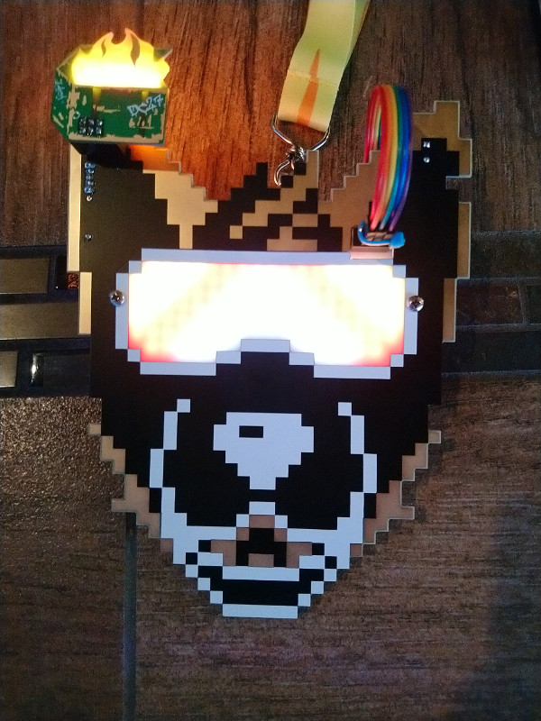
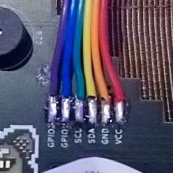
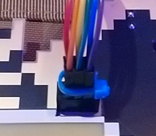
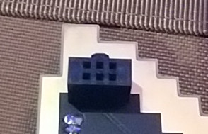

# DEFCON Furs DC27 Bootleg Badge Face

This year's DCFurs badge is a bit different - it has a PCB "host" and an acrylic overlay "face".
After learning this, I couldn't help but wonder if I could make my own face. I could certainly make one after DEF CON, but that's no fun.
So, I deduced as many measurements as I could from the teasers, made some potato-spec pixel art based on the DC26 badge, and sent it.

This bootleg overlay also features two GPIO items: a buzzer and a switch.

Will it fit? Will it look like shit? Who knows!

## It works!

## Assembly

Assembly is only required if you wish to use the SAO header.

Note that the cut-out for the host SAO header may be too tight. I can file the cut-out to make it fit, just find me. The same goes for spare parts. Twitter @ExtantBogon is probably the best way of reaching me.

#### Included components
- PCB.
- 6 pin ribbon cable.
- Unobtanium SAO v1.69bis connector.
- Piezo buzzer.
- 10 KOhm resistor.
- Switch.
- 2 zipties.

The buzzer, resistor, and switch may be omitted. The GPIO pins were not implemented on the badge, so these will not function.

#### Ribbon cable wiring
The supplied ribbon cable will need to be split and stripped on one end, and zip-tied together on the other.  

I recommend using the provided ziptie to keep all of the pins together.

Instructions for the switch and buzzer aren't included, as they don't work by default. It's super simple though, if you really want to add them.  
The GPIO CAN work though! IF an SAO interacts with the GPIO pins. A good example is the voodoo.sh SAO - pressing the pin on this SAO will cause the Bootleg Booper's buzzer to go off.

## Behind the Scenes

### How did I do?
| Things that keep me up at night | Result |
| ---- | ---- |
| Did the boards arrive on time? | Yes. |
| Did I screw up the gerbers? | No... Ok, maybe a little. |
| Did the fab screw up my gerbers? | No. |
| Does it fit? | With minor clearancing, yes! |
| Are the holes the right size? | Yes! |
| Did I need to break out the drill and/or file? | Yeah.... |
| Do the LEDs shine through the board enough? | Yes! |
| Are the GPIO pins even implemented on the badge? | Nope! |
| Does the SAO ribbon cable work? | The original one doesn't, but the fixed one does. |
| Is the SAO ribbon cable pinout correct? | No, but that's irrelevant now. |
| Does the buzzer work? | No - no GPIO. |
| Is the buzzer off by default? | Yes. |
| Does the switch work? | No - no GPIO. |
| Does the boop sensor work through the face? | Yes! |
| Does the badge break spec and run at 5v instead of 3.3 again? | Oh. It's actually 3.3v this time. |

### Problems

#### I couldn't determine the hole size.
All I could make out from the low-res teasers was that the mounting holes were somewhere between 2mm and 3.5mm. I just spec'd the holes at 3.7 and hoped for the best.

#### I didn't know the default state of the GPIO pins.
The buzzer expects GPIO to sink to activate it. If the badge sinks by default, the buzzer will always be on.... So, I added a solder bridge for both GPIO items. It's disconnected by default, but can be easily joined during assembly once I know if they'll work. It turns out that the badge doesn't use GPIO, but these are still useful if an SAO is doing weird things with those pins.

#### The SAO connector is at a weird height.
The Bootleg Booper needs to connect to the SAO connector, but the connector wouldn't fit board-to-board. To get around this, I opted to use a ribbon cable with a male connector on one end and raw soldered connections on the other.

#### The fancy SAO connector doesn't mate well enough.
The pins on my fancy connector aren't long enough. They mate for a fraction of a millimeter, and will stay in place, but a slight jostle will cause it to pop out. I made a trip to Microcenter the night before I flew out and bought a few hundred male-to-male jumpers. The jumpers fit great!

#### The SAO hole isn't big enough.
It WAS big enough when I used the correct measurements... but then I had a terrible case of The Dumb and made it 2mm *smaller* instead of *larger*. So, I bought a hand file the night before flying out. Each board needs to be clearanced with this file, but it looks surprisingly ok.

### Timeline
| Date | Event | Stress level |
| ---- | ---- | ---- |
| 19-07-02 | Can I do the thing? | Normal. |
| 19-07-02 | I bet I can do the thing. | Normal. |
| 19-07-10 | Measurements deduced from teasers. | Suddenly high. |
| 19-07-12 | Design begins. | Moderate. |
| 19-07-17 | Order for 20 boards placed via AllPCB. | Palms are sweaty. |
| 19-07-20 | AllPCB ship date missed. | Medium. |
| 19-07-21 | AllPCB's website goes down. | It's ASP.net 4.0. High. |
| 19-07-22 | AllPCB order shipped. | Lower. |
| 19-07-22 | Digikey order placed. | High again. |
| 19-07-23 | Digikey order shipped. | Lower again. |
| 19-07-23 | AllPCB arrival date missed. | Meh. Saw it coming. |
| 19-07-24 | AllPCB order arrives. | Knees weak, arms are heavy. |
| #TODO | Stuff. | More stuff. |
| 19-08-08 | Fist test fit. | Mom's spaghetti. |
| 19-08-08 | It FITS! | Pure bliss. |

### Schematics
Schematics will be added after DEF CON. Probably.
